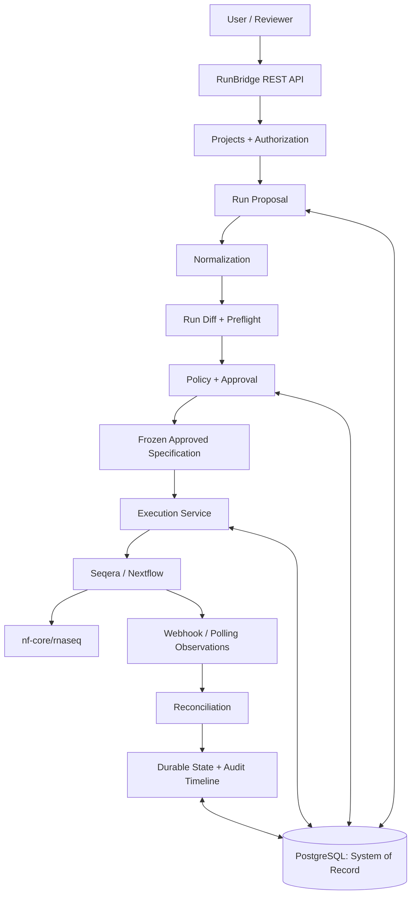

# RunBridge

**Preflight, approval, and audit infrastructure for expensive computational workflows.**

RunBridge is a Go control plane between a person requesting a scientific workflow and the platform that executes it. Its first vertical slice supports **nf-core/rnaseq through Seqera / Nextflow**, with PostgreSQL as the system of record.

**Current status: Phases 0–15 implemented and locally verified.** The repository contains project authorization, deterministic nf-core/rnaseq normalization, preflight, semantic Run Diff, immutable approvals, PostgreSQL persistence, Seqera launch/status/cancellation adapters, durable submission attempts, conservative reconciliation and polling workers, signed event intake, append-oriented audit access, integrity receipts, operational metrics, Docker packaging, and validated AWS Terraform. No live workflow or billable AWS resource is created by the test suite; a live deployment is intentionally not claimed.

## The Problem

Computational workflows combine large datasets, expensive cloud compute, complex parameters, workflow and container revisions, scientific assumptions, and human approvals. A small configuration mistake can waste compute, cause unexpected cost, invalidate an analysis, or make results difficult to reproduce.

Workflow engines answer: **How do I execute this workflow?**

RunBridge asks: **Should this exact workflow configuration be executed, who approved it, and can we prove what actually ran?**

The initial users are bioinformatics engineers submitting runs, scientists reviewing configuration changes, team leads approving execution, and platform engineers responsible for reliable operations. RNA sequencing is the initial application domain; the engineering focus is APIs, authorization, persistence, state, and external-system reliability.

## What RunBridge Does

```text
Propose → Diff → Preflight → Approve → Execute → Reconcile → Audit
```

1. **Propose:** capture a user's intended workflow, inputs, configuration, and project.
2. **Diff:** normalize the specification and compare it with a selected baseline or prior approved run.
3. **Preflight:** return structured results for deterministic scientific and configuration checks.
4. **Approve:** evaluate policy and obtain a reviewer decision when required, bound to the exact specification.
5. **Execute:** submit the frozen, authorized specification to Seqera.
6. **Reconcile:** resolve external state through polling and execution events, including uncertain submissions.
7. **Audit:** preserve the evidence connecting intent, approval, submission, and outcome.

The flow describes the review experience, not independent unguarded API calls. Both diff and preflight reference the same normalized specification before approval; durable audit events record the corresponding aggregate changes.

## Run Diff

**Run Diff is a first-class feature.** It compares normalized specifications against a previous run, project baseline, approved configuration, or another accessible specification.

Meaningful differences include workflow revision, parameters, samples and input references, reference genome, requested CPUs and memory, containers, and execution configuration. A reference genome is the reference sequence used to interpret the input data; changing it can change the interpretation of an analysis.

Comparing JSON strings cannot reliably distinguish formatting changes from scientific or resource changes. RunBridge normalizes supported fields, preserves meaningful distinctions, and produces structured differences that can drive both human review and deterministic policy. Missing values, explicit defaults, units, and order-sensitive fields need defined comparison semantics. Unknown fields must not silently disappear.

Run Diff is implemented for normalized nf-core/rnaseq specifications as a deterministic domain package. See [architecture](docs/architecture.md), [ADR-0006](docs/adr/0006-semantic-run-diff.md), and [Phase 6](ROADMAP.md#phase-6--run-diff). Baseline lookup and access checks remain application-layer responsibilities.

## Preflight

Implemented checks cover required fields, supported workflow and revision, sample input structure, project access, reference configuration conflicts, and resource boundaries. Results identify the check, affected field, severity, and reason. Preflight cannot prove scientific correctness or guarantee that remotely referenced inputs remain unchanged.

## Approval

**Approval applies to a specific normalized run specification.** Changes to execution-relevant intent will require renewed validation, diff, policy evaluation, and approval when required. A mutable proposal and an immutable approved revision are separate concepts.

The invariant is: **the run that executes must correspond to the run specification that was approved.** Simple code/config-driven rules will determine approval requirements. Policy-permitted runs that do not need human review will still have an explicit authorization decision. See the [approval model](docs/approval-model.md).

## Execution

The initial execution backend is Seqera, running Nextflow and nf-core/rnaseq. RunBridge sits above that platform; Nextflow remains responsible for workflow execution. The narrow integration boundary translates frozen intent into an external request and retains identifiers and submission evidence. Each attempt uses an opaque deterministic run name so a lost launch response can be reconciled before retry.

## Durable State

Run state survives server restarts, repeated requests, duplicate events, network failures, and retries. PostgreSQL persists transitions and the evidence needed to resume work.

An especially important case is **SUBMISSION_UNKNOWN**: Seqera may accept a launch while RunBridge loses the response. Retrying immediately could launch another expensive run. RunBridge retains the uncertain attempt and reconciles against workspace-scoped Seqera workflow listings before deciding whether another submission is safe. The [lifecycle](docs/run-lifecycle.md) and [reliability design](docs/reliability.md) describe this boundary.

## Auditability

The chronological event history records the proposal, diff, preflight result, policy decision, approval, approved specification, submission attempt, external execution ID, state transitions, relevant artifacts, and final status.

It answers: **Who requested what, what changed, who approved it, what executed, and what happened?** Audit evidence references immutable revisions and distinguishes user actions, internal coordination, and external observations. See the [audit model](docs/audit-model.md).

## System Architecture

This is a target design, not a deployed system.



The intended starting architecture is one Go service with structured domain boundaries and PostgreSQL. Background coordination can run within the same deployment, using durable database records rather than a separate message queue. See [architecture details](docs/architecture.md).

## Example Scenario

**Illustrative only: these are hypothetical values, not actual project runs or execution results.**

| Field | Previous specification | Proposed specification |
| --- | --- | --- |
| Samples | 24 | 72 |
| Requested memory | 16 GB | 64 GB |
| Requested CPUs | 8 | 32 |

RunBridge would surface these changes before execution and evaluate the configured review requirements. Resource units and whether a limit applies to an individual task or the run context must be explicit; these example values do not imply a cost estimate or a universal Nextflow resource field.

## Reliability Challenges

The execution boundary requires more than CRUD: duplicate submissions, crashes between database updates and external calls, webhook redelivery, eventual consistency, API outages, and cancellation racing with completion all affect correctness. The execution package and PostgreSQL store provide scoped attempt identities, transactional state changes, bounded retry decisions, persistent submission attempts, and reconciliation interfaces. An HTTP timeout is not proof that a launch failed, and a cancellation request is not proof that execution stopped.

## Security / Authorization

Server-side authorization enforces project memberships and roles for the implemented audit and execution queries. Viewer, runner, reviewer, and admin roles are modeled in the domain. Approval records preserve reviewer identity and immutable targets; membership and submission eligibility checks remain required at future command boundaries. Machine identities may be added later. Credentials belong in secret storage, not source control or audit payloads.

## Reproducibility / Integrity

The design uses a canonical normalized specification and immutable approval target. The integrity foundation now derives SHA-256 specification and artifact-manifest hashes and persists approval and execution receipts; chained hashes and potential AWS KMS-backed signatures remain later hardening.

Hashes attest to recorded bytes, not scientific validity or the contents behind a mutable URL. Pinned workflow/container references and versioned input evidence will be necessary to strengthen reproducibility.

## Initial Scope

### MVP

- nf-core/rnaseq only, through Seqera / Nextflow.
- Human-driven proposals and project-level authorization.
- Run Diff, deterministic preflight, simple approval rules, and reviewer workflow.
- Durable execution lifecycle, submission reconciliation, and audit history.
- Observability and basic deployment.

### Later

Additional nf-core workflows, machine identities, agent-submitted proposals, an A2A interface, expanded cost/budget controls, and potentially other execution backends may follow a reliable first vertical slice. None exists today.

## AI / Agent Philosophy

RunBridge is designed so that AI systems may eventually propose or explain actions, while deterministic software remains responsible for authorization and execution. Possible uses include explaining Run Diff, summarizing preflight failures, and helping construct proposals. **AI does not approve or directly bypass policy.** The MVP must work fully without an LLM; A2A is deferred. BioLab is a separate project, with no code sharing or integration in this scope.

## Technology

**Present:** Go domain packages for human actors, projects, memberships, proposals, immutable specification revisions, workflow identity, normalized configuration values, and run status vocabulary. The authorization package resolves project membership and evaluates explicit permissions. `internal/runs/rnaseq` defines and canonically normalizes the first workflow-specific request. `internal/preflight` evaluates structured workflow, configuration, project, and resource checks. `internal/policy` makes deterministic allow/review/deny decisions, and `internal/approvals` binds those decisions to exact specification revisions. PostgreSQL migrations define durable project, proposal, approval, execution, attempt, audit, and integrity-receipt structures. The service exposes health, readiness, metrics, authorized audit/execution reads, polling-based Seqera observations, and signed event intake for a configured relay.

**Stack:** Go, REST, PostgreSQL, Seqera API, Nextflow, nf-core/rnaseq, Docker, AWS ECS/RDS/ALB, Terraform, and GitHub Actions. **Planned platform extensions:** Amazon EKS, Helm, and OpenTelemetry (OTel); these are roadmap targets rather than implemented or deployed components.

**Observability:** `internal/observability` provides server-owned request correlation IDs, structured completion and worker-error logging, run correlation primitives, atomic reliability counters, and Prometheus-compatible export. Environment-specific tracing and dashboards can be added later. `deployments/terraform/` contains a validated ECS, ALB, and RDS deployment; it is not a claim of a live production environment.

**Security:** bearer-token authentication protects project APIs; relay events use timestamped HMAC-SHA256 verification, replay limits, and bounded bodies; and global responses include conservative security headers. The deployment adds TLS ingress, managed secrets, a read-only non-root container, narrow IAM, private PostgreSQL, restricted security groups, and automated Go vulnerability scanning. A full production identity provider remains later work.

**Integrity foundation:** `internal/integrity` derives SHA-256 identities from exact normalized specification bytes, canonical artifact manifests, approval receipts, and execution receipts. **Later hardening:** chained audit hashes and AWS KMS signing after the execution path is reliable.

## Repository Structure

| Location | Intended responsibility |
| --- | --- |
| `cmd/runbridge/` | Service entry point, HTTP routes, and worker wiring |
| `internal/auth/`, `internal/projects/` | Identity, permissions, memberships, and project isolation |
| `internal/authorization/` | Project-scoped role and permission evaluation |
| `internal/runs/` | Proposals, specification revisions, normalization, and domain invariants |
| `internal/runs/rnaseq/` | nf-core/rnaseq request validation and deterministic normalization |
| `internal/preflight/` | Structured deterministic readiness checks |
| `internal/rundiff/` | Semantic comparison of normalized rnaseq specifications |
| `internal/policy/`, `internal/approvals/` | Rules, reviewer decisions, and immutable approval targets |
| `internal/execution/` | Durable coordination, retries, cancellation, and reconciliation |
| `internal/postgres/` | Embedded PostgreSQL migrations and persistence adapters |
| `internal/audit/`, `internal/observability/` | Event history and operational signals |
| `integrations/seqera/` | External API translation and behavior |
| `configs/`, `deployments/` | Runtime configuration guidance, Docker, and AWS Terraform |
| `docs/` | Architecture, lifecycle, approval, audit, and reliability designs |
| `tests/integration/`, `tests/fixtures/` | PostgreSQL integration verification and sanitized fixture data |

Empty `.gitkeep` files retain the remaining planned directories in Git; they are not implemented packages. This layout is provisional and may be simplified as the first vertical slice reveals real boundaries.

## Runtime configuration and verification

With `DATABASE_URL` set, or with `DB_HOST`, `DB_PORT`, `DB_USER`, `DB_PASSWORD`, and `DB_NAME` supplied separately, the service runs embedded PostgreSQL migrations at startup. A configured database also requires `SEQERA_TOKEN`, `RUNBRIDGE_API_TOKEN`, and actor identity; startup fails closed when those boundaries are incomplete. `RUNBRIDGE_WEBHOOK_SECRET` enables signed event intake for a configured relay. Secrets belong in a managed secret store, never in Git.

The repository’s repeatable checks are:

```sh
go test -race ./...
go vet ./...
git diff --check
terraform fmt -check -recursive deployments/terraform
```

The latest coverage run reports package coverage for the tested domain and integration boundaries. Run `make test-integration` with `RUNBRIDGE_TEST_DATABASE_URL` pointing to a dedicated PostgreSQL database to verify migrations, exact-byte persistence, project isolation, transactional rollback, durable submission claims, reconciliation recovery, retry conflict handling, and transition audit records.

## Current Status

**Phases 9–15 — complete in the repository.** Durable transitions, atomic attempts, exact-name Seqera reconciliation, lifecycle polling, authenticated event intake, transactional audit coverage, integrity receipts, operational counters, Docker packaging, and a complete Terraform deployment slice are implemented and tested. A live AWS rollout is deliberately unperformed because it requires credentials and creates charges.

Run unit checks with `go test ./...`. PostgreSQL integration tests run when `RUNBRIDGE_TEST_DATABASE_URL` points to a dedicated test database; each test creates and removes its own schema.

## Roadmap

The [full roadmap](ROADMAP.md) progresses from domain modeling, PostgreSQL, and authorization to the rnaseq specification, preflight, Run Diff, and approval. It then covers Seqera integration, durable execution, reconciliation, webhooks, audit access, integrity, observability, and deployment. UI, expanded budget controls, agents, A2A, and additional workflows follow later. Phases are gates, not delivery dates.

## Non-Goals

RunBridge is not a replacement for Nextflow or Seqera, a new workflow scheduler, a generic orchestration engine, a computational biology algorithm, a new LLM framework, an autonomous scientific agent, a RAG system, an MCP server, or a Kubernetes platform.

The MVP excludes custom compute infrastructure, advanced policy DSLs, ML cost forecasting, recommendation engines, vector databases, agent orchestration, and chaos engineering. It does not need Kafka, Redis, microservices, a service mesh, custom distributed queues, or LLM orchestration. Add infrastructure only when demonstrated requirements justify it.

Its contribution is **governance, approval, reliable execution control, and auditability around computational workflows.**

## License

[MIT License](LICENSE).
