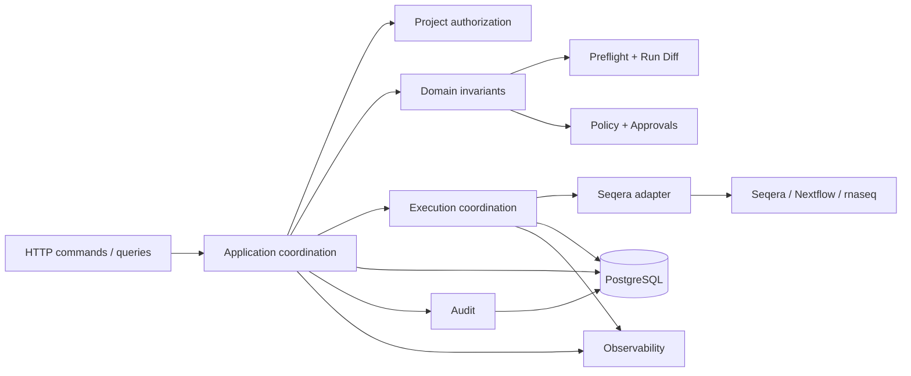

# Architecture

The core domain model, PostgreSQL persistence foundation, domain authorization boundary, nf-core/rnaseq specification normalization, deterministic preflight checks, semantic Run Diff, policy-bound approval decisions, and the narrow Seqera transport adapter are implemented through Phase 8. Execution coordination remains planned. The target remains one Go service, PostgreSQL, and one Seqera integration for nf-core/rnaseq.

## Boundaries and dependencies

Domain rules should not depend on HTTP request types, SQL drivers, or Seqera payloads. Application coordination will combine domain decisions, persistence, authorization, and external adapters. Directory boundaries express responsibilities, not microservices; avoid speculative interfaces and generic workflow frameworks.

## API layer

The REST layer will receive commands and queries, authenticate callers, establish request context and correlation, validate transport shape, and return structured errors. Domain services will enforce invariants regardless of transport. Cancellation of an incoming request must not erase a persisted launch intent or imply cancellation of a remote execution. Listing and lookup queries require the same project isolation as mutations.

## Domain layer

The run domain owns proposals, versioned specifications, workflow identity, conceptual status, and approval/execution correspondence. The rnaseq package now produces a versioned canonical configuration with explicit sample ordering, resource units, and structural reference requirements. A proposal may evolve; an approved revision must remain immutable. Run Diff and preflight results must reference the same revision used by policy. Canonicalization must be versioned so future normalization changes cannot silently reinterpret past approvals.

## Project / auth layer

An upstream authentication adapter will establish actor identity; the implemented authorization boundary determines allowed actions. Projects and memberships define access to proposals, comparison baselines, approvals, executions, and artifacts. The current role matrix covers viewer, runner, reviewer, and admin with explicit read/propose/review/cancel/manage permissions. Server-side checks bind every referenced object to the authorized project. Credential verification, sessions/tokens, and separation-of-duties policy remain implementation decisions for the API; later machine identities must use this same boundary.

## Preflight layer

Preflight performs deterministic structural and configuration checks for the supported rnaseq specification and returns check codes, statuses, fields, and messages. It verifies canonical persisted bytes, project permission to propose, and trusted sample/CPU/memory boundaries. Checks of remote input access are observations at a point in time, not promises of future availability. Future persistence will record check version and result freshness; policy must decide when revalidation is required.

## Run Diff layer

Run Diff compares validated normalized rnaseq specifications and emits categorized, structured changes in workflow revision, inputs, sample metadata, references, parameters, resources, and execution environment. Human rendering must derive from this structured result. Baseline and proposed specification identities are part of the comparison evidence. A missing baseline is an explicit first-run condition, not an empty diff or implicit authorization. Baseline lookup and access checks belong to the application layer and must use project authorization. Preserve order where meaningful and distinguish unknown, absent, and explicitly supplied values.

## Policy / approval layer

The initial deterministic policy denies failed preflight, requires review for first runs or non-empty Run Diff, and records explicit policy approval for unchanged passing runs. Approval decisions bind to one immutable specification and copied review context, not a proposal's latest pointer. No-review decisions still need durable authorization evidence. Changes or stale evidence require re-evaluation. Reviewer authorization remains a server-side application concern. See [approval model](approval-model.md).

## Execution layer

Execution coordination will persist submission intent before external work, enforce legal transitions, prevent competing workers from taking the same attempt, and resume incomplete work after crashes. It will coordinate bounded retries, polling, event processing, cancellation, and ambiguous submission reconciliation. Worker ownership alone cannot guarantee an external side effect occurs once. Never infer remote non-execution merely from an expired lease or a timeout.

## Seqera integration

The adapter owns the documented HTTP paths for launch, workflow lookup, and cancellation, bearer-token transport, API-version headers, response decoding, and basic error classification. It returns external identifiers and status but never mutates the local lifecycle. Launch payload mapping from the approved rnaseq specification, idempotency facilities, correlation searches, webhook authentication, and consistency guarantees must be verified before production execution; this phase assumes none without evidence.

Submission must derive from frozen execution-relevant data. Credentials are resolved separately, and any mutable profile, reference, or environment that can alter intent needs pinning or explicit recorded resolution. Save submission evidence to demonstrate the mapping between approval and the external request. See [reliability](reliability.md).

## Persistence and transaction boundaries

PostgreSQL is the system of record for identities, projects, memberships, proposals, normalized revisions, policy decisions, approvals, run state, submission attempts, external execution IDs, and audit events. The Phase 2 schema establishes these structural relationships and expected access indexes; later phases will evolve it when validation, diff, execution, and artifact domain models become concrete.

Current aggregate writes use short transactions, and revision creation locks its proposal row before checking the next revision. Future lifecycle operations must commit a state change, its audit event, and any durable work intent together. Unique constraints and conditional state/revision updates protect against concurrent commands. External HTTP calls cannot commit atomically with PostgreSQL. Persist intent, perform the call outside the transaction, and record or reconcile its outcome. No distributed transaction or queue is assumed to remove this uncertainty.

## Audit and observability

Audit is append-oriented durable evidence, scoped by project and linked to immutable objects. Logs are operational diagnostics and do not replace audit history. Structured logs, metrics, and useful traces will correlate request, project, run, attempt, and external identifiers while excluding secrets and sensitive raw inputs. Use bounded metric labels rather than per-run labels. See [audit model](audit-model.md).

## Integrity direction

The first approval implementation must preserve exact intent through immutable revision identity and controlled submission. Later cryptographic hardening will add canonical SHA-256 specification hashes, manifests, approval/execution receipts, and possibly KMS signatures. A signature authenticates recorded evidence; it cannot prove the execution platform ran unmodified code without corresponding platform evidence.

## Scope and open decisions

Build one real vertical slice before abstracting: nf-core/rnaseq, Seqera, human requests, one approval model, one lifecycle. Docker and a modest AWS deployment come later. BioLab remains separate; no MCP, A2A, agents, Kubernetes, scheduler, or new messaging infrastructure belongs in the MVP.

Implementation must settle role grants, revision pinning, input identity, canonicalization rules, policy freshness, supported Seqera correlation mechanisms, event ordering, retention, and deployment topology. These are explicit design questions rather than promises of external capabilities.
