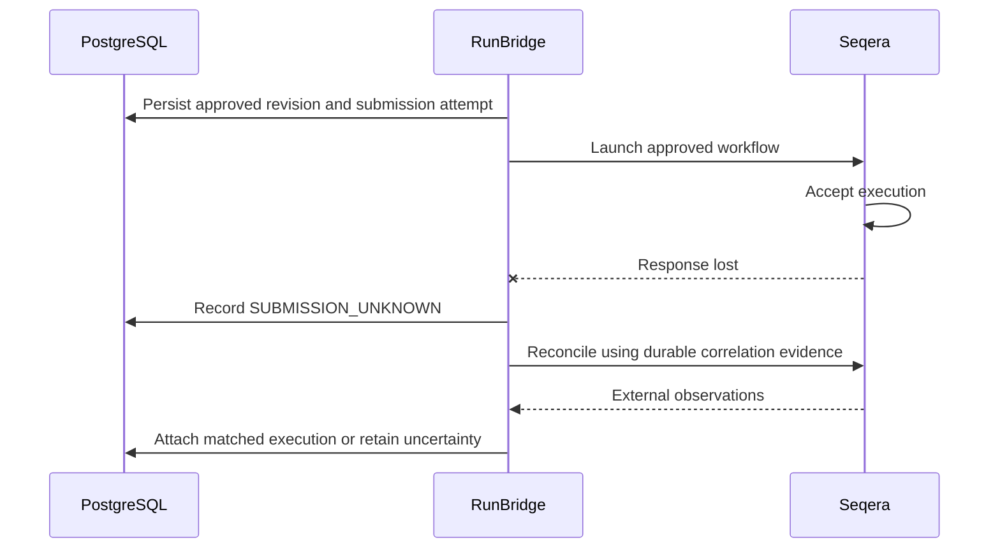

# Reliability design

Stage 1 requirements, not implemented guarantees. RunBridge controls expensive external side effects. PostgreSQL can serialize local decisions, but it cannot make a remote launch atomic with a local commit. The design favors explicit uncertainty over accidentally launching duplicate work.

## Failure model

Clients may retry or disconnect. Processes may crash at any instruction. Multiple workers may contend for work. PostgreSQL or Seqera may be unavailable. A remote request may succeed even if its response is lost. Events may be duplicated, delayed, reordered, or absent. Remote searches may lag acceptance. Cancellation may race with completion.

## Idempotency

Future mutating commands should accept a durable idempotency identity scoped to the project, operation, and authorized caller context. Persist the request identity and normalized payload identity with the outcome. A repeated key with the same payload returns the original operation; reuse with a different payload is a conflict. Authorization still applies when returning a cached result.

Database uniqueness and conditional updates must guard concurrent requests. Document retention so key expiry cannot silently make a delayed retry a new launch. Local idempotency prevents duplicate local commands; it does not by itself make Seqera launch exactly once. A deliberately requested rerun requires a distinct operation and current authorization.

## Transaction boundaries

The intended launch sequence is:

1. In PostgreSQL, verify approved revision and current eligibility, claim the operation, persist SUBMITTING and a submission attempt, and append launch-intent evidence atomically.
2. Commit before contacting Seqera. Keep database locks out of the external call.
3. Submit the exact approved execution intent with a durable correlation identifier where the external platform supports it.
4. Persist the external ID and observed state in a new transaction, or preserve ambiguity for reconciliation.

No ordering removes the failure window. Calling first risks an unrecorded launch; committing intent first requires recovery when the call outcome is unknown. Distributed transactions are not assumed across PostgreSQL and Seqera. A separate queue would not eliminate this boundary either.

## SUBMISSION_UNKNOWN and network uncertainty

The launch arrow is conceptual, not a specified API endpoint. If RunBridge crashes before recording uncertainty, recovery must treat stale SUBMITTING attempts as potentially accepted. Neither an HTTP timeout nor a process crash proves a run was never launched.

## Reconciliation

Persist correlation before sending a launch. During integration work, verify whether Seqera supports idempotency tokens, searchable launch metadata, stable external IDs, and sufficiently authoritative observations. Do not assume these capabilities exist.

| Evidence | Intended response |
| --- | --- |
| Exactly one verified matching execution | Attach its ID and reconcile authoritative state, including an already terminal result |
| No match in a potentially lagging search | Retain uncertainty and retry the observation with backoff |
| Multiple candidates or inconsistent evidence | Retain uncertainty; surface an auditable operator investigation |
| Definitive nonacceptance, or a verified externally idempotent retry mechanism | Permit a guarded retry if approval and cancellation eligibility still hold |
| External system unavailable | Keep durable unresolved work; retry reads within limits and expose operational status |

Matching must consider project/external workspace, attempt correlation, and execution intent, not just a friendly run name. If the external API cannot establish safe retry conditions, halt automatic resubmission and require evidence-based resolution. An operator must not convert uncertainty to failure just to unlock a retry; a deliberate new launch that accepts duplication risk requires a separately authorized, auditable decision.

The reconciliation foundation encodes this conservatively: one match can be adopted, multiple matches require manual review, and an empty result remains unknown unless definitive nonacceptance is proven. A worker must persist observations and its decision before applying the local transition.

## Crash recovery

| Crash point | Required recovery behavior |
| --- | --- |
| Before launch-intent transaction commits | No durable operation exists; a client retry may create one |
| After intent commit, before or during remote call | Treat the attempt as potentially sent unless non-send can be proven |
| After remote acceptance, before external ID commit | Reconcile acceptance; never blindly relaunch |
| After outcome commit, before client response | Return the stored operation on an idempotent retry |
| During external event processing | Durable delivery and transition handling allow safe replay |

Workers may use bounded leases or equivalent database coordination with conditional updates. An expired lease does not stop a delayed worker's external request. Fencing local writes protects local state only; do not claim it fences Seqera without external support. Recovery must retain attempt identity and account for delayed in-flight calls.

## Retry behavior

Classify errors by operation and certainty. Safe reads can use bounded exponential backoff and jitter, honoring applicable rate limits. Configuration/authentication failures need corrective action, not infinite retries. Ambiguous launch errors enter reconciliation; even some server errors may occur after acceptance. Persist attempt count, last error category, and next eligible retry time so restarts do not create retry storms. Deadlines bound resource use but do not undo external side effects.

## Webhook duplication and ordering

Verify supported source authentication before trusting deliveries. Durably record accepted deliveries and deduplicate by a stable source identity where available; otherwise define a conservative strategy against actual payload semantics. Acknowledge success only after required persistence, so an interrupted consumer can safely replay.

State updates must be conditional and idempotent. Late RUNNING observations must not regress terminal state. Contradictory terminal observations require authoritative reconciliation. Keep source event time and receive time separate. Webhooks are hints/evidence from an external source; polling provides a recovery path for missing deliveries and long periods without updates. Do not assume exactly-once delivery or a total event order.

## Cancellation

Persist cancellation intent and actor authorization. Before launch, cancellation and launch claiming compete within a local transaction. After launch may have started, request external cancellation only through supported behavior and reconcile the result. If the external ID is unknown, first resolve submission while keeping cancellation intent active; do not launch a new attempt during that process.

An accepted cancellation request is not confirmation that computation stopped. Completion can win, yielding SUCCEEDED or FAILED despite a prior cancellation request. Record both the request and the confirmed outcome. Exact mapping of remote states and repeated cancellation behavior remains an integration decision.

## Eventual consistency and operations

RunBridge may temporarily lag Seqera. Queries should expose last observed time and uncertainty rather than imply immediate synchronization. Persist terminal evidence and continue artifact discovery independently when needed. Approval and local state changes can be strongly coordinated within PostgreSQL, while external execution observations converge through reconciliation.

Planned signals include age/count of unresolved submissions, stale observations, retry attempts, duplicate deliveries, transition conflicts, integration failures, and approval/submission latency. Use run/attempt IDs for logs and traces, with bounded metric dimensions. Alerts and operator actions must preserve evidence and project isolation.

## Verification gates for later phases

Future domain and integration tests should exercise concurrent repeated commands, changed payloads under one key, approval edits racing with launch, crashes around each persistence boundary, lost launch responses, delayed search visibility, delayed workers after lease expiry, duplicate/out-of-order events, and cancellation racing with completion. A deterministic fake external adapter can model failures before any controlled live integration test. No such tests or product behavior are introduced in Stage 1.
