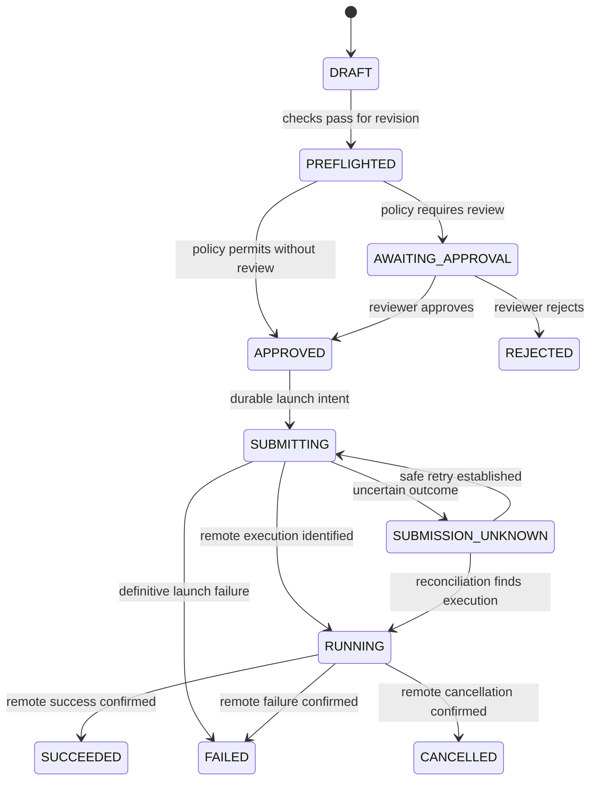

# Run lifecycle

The execution transition graph is now validated in `internal/execution`; durable coordination is still being built. PostgreSQL will retain lifecycle state, revision identity, and transition evidence. Run status and individual submission attempts are related but distinct: a transport retry is not a new scientific intent.

The diagram shows the main path; guarded alternatives below also apply. External states may be more detailed, including queued execution. For this conceptual model, RUNNING means an identified, accepted, nonterminal external execution, not necessarily active CPU usage.

| State | Meaning | Actor / guarded next steps |
| --- | --- | --- |
| DRAFT | Editable proposal with a revision identity | Authorized runner requests validation; passing checks advance to PREFLIGHTED; failures remain recorded without readiness |
| PREFLIGHTED | Passing checks for the specific revision; diff must be available before policy decision | Internal deterministic policy denies, requires review, or permits APPROVED; revised intent returns to DRAFT |
| AWAITING_APPROVAL | Policy requires a human decision on frozen review context | Authorized reviewer grants APPROVED or REJECTED; a revision change invalidates this request |
| APPROVED | Exact revision authorized by reviewer or explicit no-review policy decision | Coordinator rechecks eligibility and atomically claims launch intent before SUBMITTING |
| SUBMITTING | A persisted attempt may be interacting with Seqera | Accepted execution becomes RUNNING; definitive rejection becomes FAILED; ambiguity becomes SUBMISSION_UNKNOWN |
| SUBMISSION_UNKNOWN | Acceptance cannot be determined safely | Reconciler finds an external execution or establishes safe nonacceptance before retry; unresolved ambiguity remains here |
| RUNNING | Accepted external execution is tracked | Verified external observations drive SUCCEEDED, FAILED, or CANCELLED |
| SUCCEEDED | External success confirmed | Terminal; later artifact recording adds evidence without reopening execution |
| FAILED | Definitive launch or execution failure | Terminal for this execution; a rerun is a new explicit request subject to current policy |
| CANCELLED | Local withdrawal before launch, or external cancellation confirmed | Terminal; distinguish the source of cancellation in audit |
| REJECTED | Reviewer or deterministic policy denied the revision | New or revised proposal can be evaluated; preserve the rejected decision |

## Transition rules

- Commands require project authorization, expected revision/state, and idempotency handling. Reviewers do not directly set external execution status.
- Pre-submission edits create a new revision, invalidate readiness and active approval, and return the proposal to DRAFT. Preserve prior immutable evidence. Once submission begins, a changed run must be a separate proposal; do not edit executing intent.
- Local withdrawal can move DRAFT, PREFLIGHTED, AWAITING_APPROVAL, or APPROVED to CANCELLED if it wins the transaction race with launch claiming.
- Policy denial can move PREFLIGHTED to REJECTED. Validation failure is structured evidence, not an external execution failure.
- Polling or authenticated execution events may reveal an already terminal remote run directly from SUBMITTING or SUBMISSION_UNKNOWN. Record the external identity and observed terminal outcome without inventing a RUNNING observation.
- SUBMISSION_UNKNOWN can become FAILED only with definitive failure evidence. A search with no results does not itself justify retry or failure.
- Cancellation during SUBMITTING, SUBMISSION_UNKNOWN, or RUNNING is a durable intent awaiting resolution. Do not label it CANCELLED solely because a cancellation request was sent. Completion may win the race.
- Repeated or stale observations do not regress state. Contradictory terminal evidence requires reconciliation and an auditable correction procedure, not silent overwriting.

## Recovery and correlation

The coordinator will recover persisted unfinished attempts after restart. Reconciliation needs durable project/run/attempt correlation, external IDs when known, and observation evidence. Seqera-derived transitions will be distinguishable from human commands and local policy decisions. Each accepted local transition and its audit record belong in one transaction.

Final state mapping, retry eligibility, cancellation representation, and correction procedures will be settled against actual Seqera behavior. See [reliability](reliability.md) for the ambiguous launch case.
